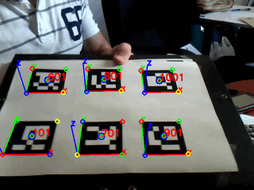

# BAR4Py (BXT-AR-For-Python)

**BXT** Augmented Reality For `Python`「**百晓通客栈** `Python`增强现实开发库」



## 依赖:

- Python3/Python3+
- Numpy
- OpenCV-3+ for Python3

## 安装:

**不管用什么安装方法必须要先安装支持 Python3 的 OpenCV-3+**

#### 方法一、下载源码编译安装

```
git clone https://github.com/bxtkezhan/BAR4Py.git
cd BAR4Py
python3 setup.py build
python3 setup.py install
```
#### 方法二、使用`pip`工具

```
pip3 install bar4py
```

## 测试

preview.py 测试代码

```python
import cv2
import numpy as np

from resconfig import *
from bar4py.debugtools import drawAxis, drawMarkers
from bar4py import CameraParameters, Dictionary, MarkerDetector

# Preview Moduels.

def preview(imagefilename=None, videofilename='video.avi'):
    # Open capture
    if not imagefilename:
        cap = cv2.VideoCapture(opjoin(RES_VID, videofilename))

    # Load Camera Parameters
    cameraParameters = CameraParameters()
    cameraParameters.readFromJsonFile(opjoin(RES_CAM, 'camera_640x480.json'))
    # Create Dictionary
    dictionary = Dictionary()
    dictionary.buildByDirectory(filetype='*.jpg', path=RES_MRK)
    # Create MarkerDetector
    markerDetector = MarkerDetector(dictionary=dictionary, cameraParameters=cameraParameters)
    while True:
        # Read video data
        if imagefilename:
            frame = cv2.imread(opjoin(RES_IMG, imagefilename))
        else:
            ret, frame = cap.read()
            if not ret: break
        markers = markerDetector.detect(frame)
        for marker in markers:
            print('ID:', marker.marker_id)
            print('RVEC:')
            print(marker.rvec)
            print('TVEC:')
            print(marker.tvec)
            print('-'*32)
        drawAxis(cameraParameters, markers, frame)
        drawMarkers(markers, frame)
        cv2.imshow('TEST', frame)
        key = cv2.waitKey(100) & 0xFF
        if key == 27: break
        elif key == 32: cv2.waitKey(0)

    # Desctroy and release
    cv2.destroyAllWindows()
    if not imagefilename: cap.release()

if __name__ == '__main__': preview()

```

```
python3 preview.py # 在项目目录下
```
