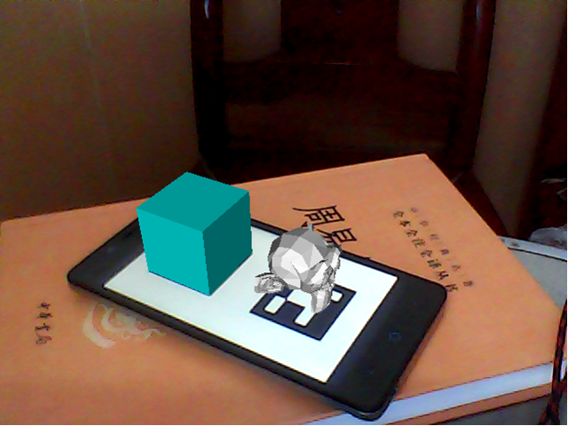

.. bar4py documentation master file, created by
   sphinx-quickstart on Sun Feb 12 20:47:51 2017.
   You can adapt this file completely to your liking, but it should at least
   contain the root `toctree` directive.

欢迎阅读 bar4py 参考文档
==================================

.. toctree::
   :maxdepth: 2
   :caption: 主要内容:

   intro
   tutorial

索引和表格
==================

* :ref:`genindex`
* :ref:`modindex`
* :ref:`search`

