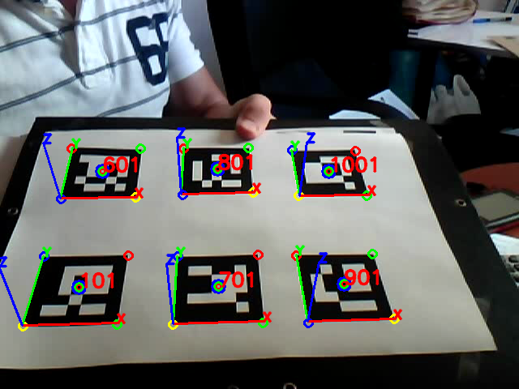

# Hello BAR4Py

**BXT** Augmented Reality For **Python**「**百晓通客栈** `Python`增强现实开发库」

[TOC]

## 效果预览：



## 代码清单：

[**代码文件链接./hello.py**](./hello.py)

**运行方法：**
```
python3 hello.py
```

## 代码解析：

### 1.引入Python增强现实开发常用库

```python
import cv2
import numpy as np

from resconfig import *
from bar4py.debugtools import drawMarkers, drawAxis
from bar4py import CameraParameters, Dictionary, MarkerDetector
```

- `cv2` - OpenCV库
- `numpy` - 矩阵运算相关库，本例中没有用到
- `bar4py.debugtools` - BAR4Py提供的调试方法，常用的有`drawMarkers, drawAxis
`，分别用于绘制标记物的矩形对角，3D坐标轴

### 2.载入一张图片

```python
frame = cv2.imread(opjoin(RES_IMG, 'image-test.png'))
```

其中`cv2.imread`是OpenCV的方法，`opjoin(RES_IMG, 'image-test.png')`是BAR4Py提供的便捷方法，用于返回资源文件中图片image-test.png的相对路径。

### 3.构建相机参数对象

```python
cameraParameters = CameraParameters()
cameraParameters.readFromJsonFile(opjoin(RES_CAM, 'camera_640x480.json'))
```

`cameraParameters = CameraParameters()`实例化一个相机参数对象，`cameraParameters.readFromJsonFile(opjoin(RES_CAM, 'camera_640x480.json'))`通过资源文件当中提供的camera_640x480.json文件设置相机参数。

### 4.构建（标记物）字典对象

```python
dictionary = Dictionary()
dictionary.buildByDirectory(filetype='*.jpg', path=RES_MRK)
```

`dictionary = Dictionary()`实例化一个（标记物）字典对象，`dictionary.buildByDirectory(filetype='*.jpg', path=RES_MRK)`通过资源文件中的marker目录构建（标记物）字典内容，其中filetype为该目录下marker图片的扩展名。

### 5.创建（标记物）检测器

```python
markerDetector = MarkerDetector(dictionary=dictionary, cameraParameters=cameraParameters)
```

通过之前构建的相机参数对象cameraParameters，和（标记物）字典对象dictionary创建（标记物）检测器对象markerDetector

### 6.检测标记物

```python
markers = markerDetector.detect(frame)
```

传入图片数组frame到detect，返回元素为Marker对象的列表。

### 7.绘制Marker对象的对角和3D坐标轴

```python
drawMarkers(markers, frame) # 对角点
drawAxis(cameraParameters, markers, frame) # 坐标轴
```

### 8.显示效果

```python
cv2.imshow('Hello BAR4Py', frame)
cv2.waitKey(0) & 0xFF
cv2.destroyAllWindows()
```
